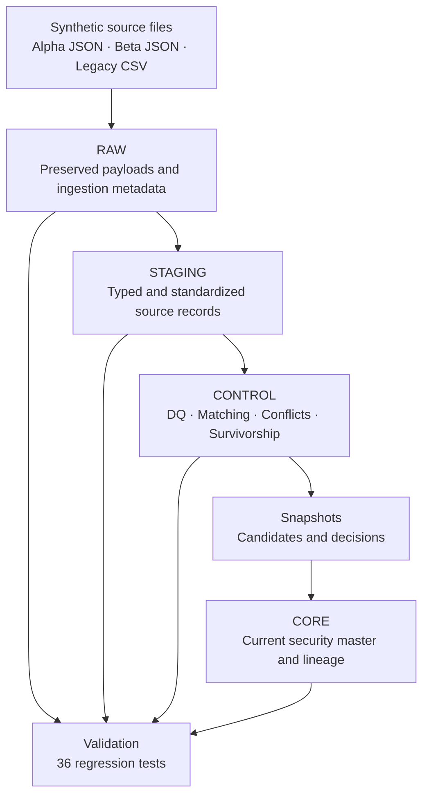

# Multi-Asset Credit Security Master

Security data rarely arrives cleanly or agrees across sources. The same
instrument can appear with missing identifiers, conflicting classifications,
invalid dates, or different values reported by different vendors. This
project implements a Snowflake security-master pipeline that preserves those
disagreements, resolves only what can be resolved under explicit rules, and
retains lineage for every selected value.

The workspace contains 91 synthetic credit-instrument records produced from
two JSON vendor feeds and one legacy CSV. The pipeline produces 32 governed
CORE records and a read-only regression validation of 36 tests. All data and
identifiers are synthetic; no proprietary vendor data is included.

## What the pipeline does

The pipeline ingests synthetic JSON and CSV payloads, safely types and
standardizes them, detects and reports data-quality issues, identifies
cross-source matches while avoiding false merges caused by identifier
collisions, and applies a governed survivorship policy that records why a
value was chosen. Key behaviors:

- preserves raw JSON/CSV payloads and ingestion metadata
- safely types and standardizes records
- detects quality failures and cross-source conflicts
- prevents false matches caused by identifier collisions
- resolves attributes through validity, canonicalization, consensus and
    effective-date rules
- publishes a deterministic CORE record with selected-value lineage

## Architecture

## Where the difficult decisions occur

Business logic is concentrated in CONTROL: quality rules, match assignment,
conflict detection and the survivorship grid. Survivor selection follows
explainable rules (validity → canonicalization → cross-source support →
effective date) and never relies on arbitrary vendor priority or alphabetical
tie-breaking. Five representative outcomes illustrate the approach:

| Example | Summary |
|---|---|
| 0006 | Invalid maturity values were rejected (maturity precedes issue date); a valid Beta maturity was chosen. |
| 0007 | A three-way rating tie across sources produced no selected rating; the record is flagged REVIEW_REQUIRED. |
| 0008 | `CLO` canonicalized to `CLO_TRANCHE`; two-source consensus selected the canonical value over a Legacy `BOND`. |
| 0009 | Multiple candidate effective dates resolved to the latest valid date (`2018-12-30`). |
| 0010 | An out-of-domain currency `ZZZ` was rejected; `GBP` was selected from supporting sources. |

Additionally, CUSIP `0003` presented a collision: two vendor records shared the same CUSIP but had distinct ISINs. Vendor records were split by ISIN for matching, and the Legacy record (which lacked an ISIN) was quarantined as `AMBIGUOUS_IDENTIFIER` rather than force-matched.

## Verified results

Key decision-relevant outcomes observed when the pipeline and validation suite were executed in Snowflake:

| Metric | Value |
|---|---:|
| RAW records | 91 |
| STAGING records | 91 |
| DQ exceptions | 2 |
| Cross-source matched records | 87 |
| Ambiguous-identifier records | 1 |
| No-identifier records | 1 |
| Single-source-only records | 2 |
| CORE security records | 32 |
| MASTERED | 29 |
| PROVISIONAL_SINGLE_SOURCE | 2 |
| REVIEW_REQUIRED | 1 |
| Regression tests | 36 passed, 0 failed |

## Pipeline files

| File | Layer | Purpose |
|---|---|---|
| `snowflake/01_setup.sql` | Setup | Create schemas and baseline objects. |
| `snowflake/02_raw_ingestion.sql` | RAW | Load and persist source payloads with ingestion metadata. |
| `snowflake/03_staging_transformations.sql` | STAGING | Parse and type-convert payloads into normalized records. |
| `snowflake/04_data_quality_controls.sql` | CONTROL | Evaluate DQ rules and emit `DQ_EXCEPTIONS`. |
| `snowflake/05_cross_source_matching.sql` | CONTROL | Produce `SOURCE_MATCH_ASSIGNMENTS` with collision-aware logic. |
| `snowflake/06_survivorship_decisions.sql` | CONTROL | Enumerate candidates and compute deterministic decisions. |
| `snowflake/07_materialize_survivorship.sql` | CONTROL | Materialize transient candidate and decision snapshots for CORE. |
| `snowflake/08_core_security_master.sql` | CORE | Build `SECURITY_MASTER_CURRENT` and attribute lineage from snapshots. |
| `snowflake/09_end_to_end_validation.sql` | Validation | Read-only regression suite asserting the above outcomes. |

## Running the project

Follow this exact order:

1. python/generate_synthetic_data.py
2. tests/validate_generated_data.py
3. snowflake/01_setup.sql
4. snowflake/02_raw_ingestion.sql
5. snowflake/03_staging_transformations.sql
6. snowflake/04_data_quality_controls.sql
7. snowflake/05_cross_source_matching.sql
8. snowflake/06_survivorship_decisions.sql
9. snowflake/07_materialize_survivorship.sql
10. snowflake/08_core_security_master.sql
11. snowflake/09_end_to_end_validation.sql

Upload the three generated source files (two vendor JSONs and one legacy CSV)
to an internal Snowflake stage before running the `COPY INTO` statements in
SQL 02. After upstream data or survivorship-rule changes re-run SQL 07 so
CORE reads refreshed snapshots.

Prerequisites: a Python environment compatible with `requirements.txt`, a
Snowflake account with privileges to create the documented objects, and the
ability to upload files to an internal stage.

## Performance

Early development revealed that repeatedly evaluating the fully nested audit
view chain was expensive: representative CORE verification queries ranged
from roughly 36 seconds to more than six minutes. Materializing the governed
candidate and decision layers into transient batch snapshots reduced observed
verification runtimes to approximately 0.3–1.1 seconds. These are
development observations, not formal benchmarks.

## Limitations

- The dataset is a synthetic fixed fixture; regression expectations depend on fixed counts.  
- Batch snapshots require explicit refresh via `snowflake/07_materialize_survivorship.sql`.  
- Currency-domain checks are project-scoped, not a complete ISO 4217 implementation.  
- Matching is deterministic and identifier-based; the project does not implement fuzzy issuer/name matching.  
- Ratings are modeled as current scalar attributes; the project demonstrates current-state mastering rather than rating histories or SCD timelines.

